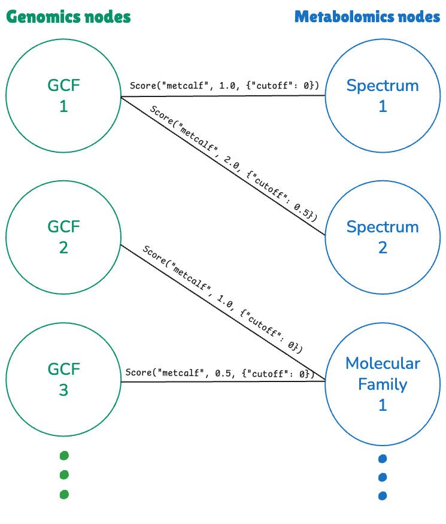

# Summary
Natural product discovery increasingly relies on the integration of multi-omics data to explore and prioritize biochemical diversity. To advance these efforts, we present NPLinker 2, a redesigned Python framework to do paired omics analyses by prioritizing genomics-metabolomics links. It provides a modular workflow that allows defining custom modules for data preparation, data loading and scoring methods. In addition, NPLinker 2 includes a web application for the interactive analysis and visualisation of promising links.


# Statement of need
Omics datasets have become a key resource for natural products discovery, enabling the systematic exploration of specialized metabolites, the refinement of knowledge of known natural products, and the identification of novel bioactive compounds or metabolic enzymes. Paired omics analyses combine complementary genomics (e.g., biosynthetic gene clusters (BGCs)) and metabolomics (e.g., mass spectra) datasets to elucidate gene-metabolite relationships, accelerating the discovery process [@goering_metabologenomics_2016; @leao_npomix_2022; @hooft_linking_2020].
Several computational strategies have been developed to propose such gene cluster-mass spectral links, including i) feature-based approaches that match predicted structural or substructure information between genomes and MS/MS (e.g., Pep2Path, MetaRiPPquest, MetaMiner, DeepRiPP) [@medema2014pep2path; @mohimani2017metarippquest; @cao2019metaminer; @merwin2020deepripp], ii) correlation-based “metabologenomics” that infer co-occurrence patterns across strains or samples [@goering_metabologenomics_2016], and iii) hybrid frameworks such as NPLinker and the machine learning classifier-based NPOmix [@eldjarn_ranking_2021; @leao_npomix_2022], with recently proposed phylogeny-aware extensions to reduce false positive associations [@boldt2026phylogeny]. However, the connected omics data structures, preproccessing pipelines, resources, and annotation tools are constantly being improved: curated BGC repositories such as MIBiG are continually expanded with new entries and annotation fields [@zdouc_mibig_2025], while community MS/MS resources such as GNPS spectral libraries keep growing [@wang_sharing_2016]. Together with the constant expansion of experimental datasets, this puts a strain on downstream frameworks that integrate processed omics data and link results. Hence, natural products discovery would benefit from up-to-date and user-friendly software packages that parse processed omics data and connect it with algorithms returning ranked, queryable gene cluster - mass spectra links to prioritize links to further investigate manually. Here, we redesigned NPLinker to provide such an integrative omics tool that guides both users and developers in paired omics mining with its modular setup. For example, recent developments in omics processing, annotation tools, and ranking metrics could be added to the framework [@louwen_enhanced_2023; @louwen_ipresto_2023]. Moreover, several of such linking scores could then be used together with the currently implemented strain correlation score to further improve ranking results.    
Omics datasets have become a key resource for natural products discovery, enabling the systematic exploration of specialized metabolites, the refinement of knowledge of known natural products, and the identification of novel bioactive compounds or metabolic enzymes. Paired omics analyses combine complementary genomics (e.g., biosynthetic gene clusters (BGCs)) and metabolomics (e.g., mass spectra) datasets to elucidate gene-metabolite relationships, accelerating the discovery process [@goering_metabologenomics_2016; @leao_npomix_2022; @hooft_linking_2020]. However, omics data structures, preproccessing pipelines, resources, and annotation tools are constantly being improved. For example, newer releases of MIBiG contain more validated BGCs and new annotation fields [@zdouc_mibig_2025], while mass spectral libraries are growing in size and information as well [@wang_sharing_2016]. Besides, newer versions of omics clustering tools have different output file formats. Together with the constant expansion of available experimental datasets, this puts a strain on downstream frameworks that integrate the data and results. Hence, researchers working in the natural products discovery field, or anyone with paired genomics and metabolomics data, would benefit from up-to-date and user-friendly software packages that parse processed omics data and connect it with algorithms returning ranked, queryable gene cluster - mass spectra links to prioritize links to further investigate manually. Here, we redesigned NPLinker to provide such an integrative omics tool that guides users in paired omics mining with its modular setup. The tool is also of interest to developers in this field, as recent developments in omics processing, annotation tools, and ranking metrics could be added to the framework [@louwen_enhanced_2023; @louwen_ipresto_2023]. Moreover, several of such linking scores could then be used together with the currently implemented strain correlation score to further improve ranking results.    


# Features of NPLinker 2
NPLinker 2 is redesigned based on NPLinker version 1.x [@eldjarn_ranking_2021] to provide a more flexible, modular and extensible framework for linking BGCs to mass spectra. The pipeline is shown in the \autoref{fig:1}, and the key features are highlighted below.

## Installation ease
NPLinker 2 is distributed as a Python package, but it relies on several third-party tools and databases that are not available via PyPi, which can make the installation more complex. To simplify the setup process, NPLinker 2 includes an installation script that automatically installs the required non-PyPi dependencies and databases.

To install NPLinker 2 and its dependencies, users can run the following commands:

```bash
# Install the NPLinker package
pip install --pre nplinker

# Install non-PyPi dependencies and required databases
install-nplinker-deps 
```

## Configurable
NPLinker 2 can be easily configured using the file `nplinker.yaml`, which is required to customise the pipeline according to users' needs, e.g., by selecting the run mode, choosing scoring methods. A [friendly template](https://nplinker.github.io/nplinker/latest/concepts/config_file/) is available on the doc website to help users create and fill in their configuration file from scratch. 

## Local mode and PODP mode
NPLinker 2 supports both local and remote data sources through two operational modes: **local mode** and **PODP mode**. In local mode, users provide their local data files, e.g., AntiSMASH [@blin_antismash_2025] output files and mass spectral data [@wang_sharing_2016] supported by matchms [@huber_matchms_2020], as input. In contrast, the Paired Omics Data Platform (PODP) [@schorn_community_2021] mode requires no input data files from the user, as the pipeline automatically downloads necessary data files from the [PODP (Paired Omics Data Platform) server](https://pairedomicsdata.bioinformatics.nl/) using the PODP ID specified in the `nplinker.yaml` file. This dual-mode support enables private and public data analysis using the same pipeline.

## Modular and extensible
Modularity and extensibility are key features of NPLinker 2, which provides a set of interfaces and data models that users can extend.

**"Prepare Data" component:** The core class of this component, `DatasetArranger`, orchestrates various downloaders and runners to automatically download and generate the required data files. These files are then stored in the local working directory specified in the `nplinker.yaml` configuration file. Users can extend this component by adding new downloaders or runners, e.g., to download BGC data from a new source or generate data files using a different method or tool.

**"Load Data" component:** The `DatasetLoader` class manages data loaders responsible for loading and parsing genomics, metabolomics, and strain data files. Users can add new data loaders to support additional sources or formats. For example, to load BGC data from a new source, one can define a Python class `NewBGCLoader` that inherits from the `BGCLoaderBase` interface and implements the `get_files` and `get_bgcs` methods, then register it within the `DatasetLoader` class.

**"Scoring" component:** This component handles the linking of data and the scoring of those links. A undirected graph is used to store the linked data, with nodes corresponding to genomics or metabolomics data items and edges representing the links between them with scoring values, as illustrated in \autoref{fig:2}. The `ScoringBase` interface is provided to allow the implementation of custom scoring methods.


{ width=40%}

## New documentation website
A dedicated documentation website is available to help users and developers understand how to use and extend NPLinker 2. It includes tutorials, conceptual overviews, pipeline diagrams, and an API reference. The documentation is available at [https://nplinker.github.io/nplinker](https://nplinker.github.io/nplinker).

## New unit tests and integration tests
Unit and integration tests are included in NPLinker 2 to ensure the codebase and the overall pipeline is correct. The tests can be run in parallel to speed up the testing process.

## Forced static typing
NPLinker 2 is developed with forced static typing, which means that all functions and methods have type hints to specify the input and output types. This helps developers to understand the code better and catch type errors early when dealing with complex genomic and metabolomic data and the processed and annotated data derived thereof. 

## User-friendly webapp

The [NPLinker web application](https://github.com/NPLinker/nplinker-webapp) (webapp) is an interactive dashboard built with [Plotly Dash](https://plotly.com/), designed to make NPLinker’s linking results accessible through a user-friendly web interface. A [publicly hosted demo](https://nplinker-webapp.onrender.com/) allows immediate testing: users can load a sample dataset with a single click and start exploring. To enable full functionality with larger datasets, the webapp can be installed locally or run via Docker (using the [nplinker-webapp image](https://github.com/nplinker/nplinker-webapp/pkgs/container/nplinker-webapp)). Notably, the webapp focuses on visualization and post-analysis; link scoring between genomic and metabolomic entries is performed beforehand by the NPLinker backend.

The linking is currently provided starting from both omics views: from Gene Cluster Families (GCFs) clustered by BiG-SCAPE [@navarro-munoz_computational_2020] to mass spectra or molecular families (MFs) clustered by molecular networking [@wang_sharing_2016] or vice vera. Once the data is loaded, the interface provides two complementary views: genomics-to-metabolomics and metabolomics-to-genomics. This dual-tab layout allows users to begin from either data type and inspect associated links in the other domain. Each view presents the input data and predicted links in sortable, filterable tables, with support for multiple filtering criteria (e.g., GCF, MF, spectrum IDs, BGC classes, score thresholds). This enables rapid prioritization of promising BGC–metabolite links. Results can also be exported as Excel files for downstream analysis and record-keeping, allowing smooth integration into existing workflows.

# Acknowledgements

This work was supported by the Netherlands eScience Center under grant number NLESC.OEC.2021.002 (M.H. Medema and J.J.J. van der Hooft). A. Lien, L. R. Torres Ortega, D. Ferreira, K.R. Duncan, M.H. Medema and J. J. J. van der Hooft acknowledge the MAGic-MOLFUN Doctoral Training Network that has received funding from the European Union's Horizon Europe programme under the Marie Skłodowska-Curie grant agreement No. 101072485 (M.H. Medema and J.J.J. van der Hooft) and and UKRI EP/X03142X/2 (K.R. Duncan).

# Conflict of Interest
JJJvdH is member of the Scientific Advisory Board of NAICONS Srl., Milano, Italy and consults for Corteva Agriscience, Indianapolis, IN, USA. MHM is a member of the scientific advisory boards of Hexagon Bio and Hothouse Therapeutics Ltd. All other authors declare to have no competing interests.

# Reference
